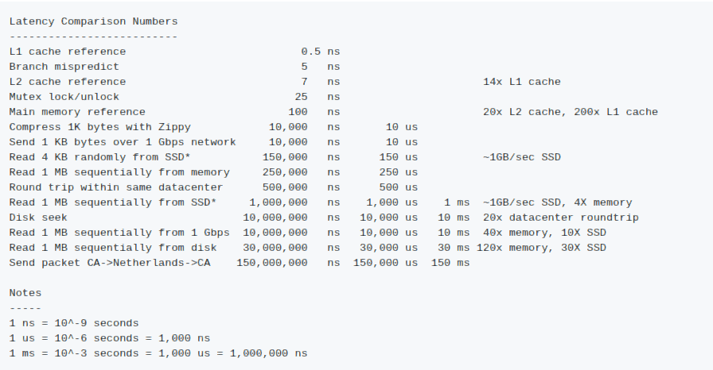
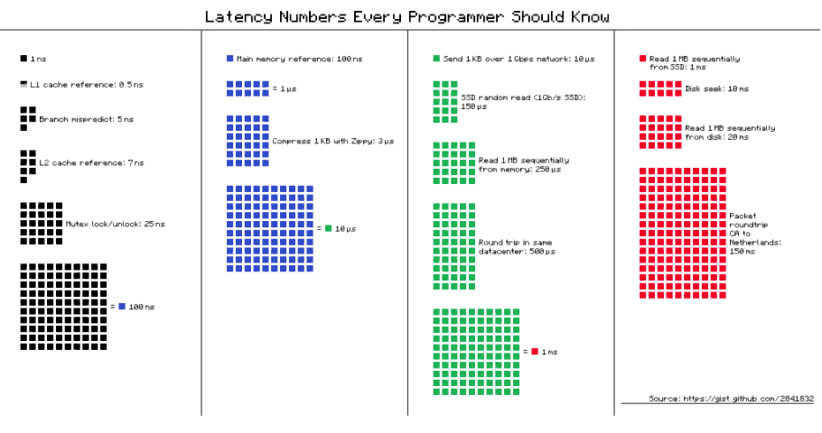
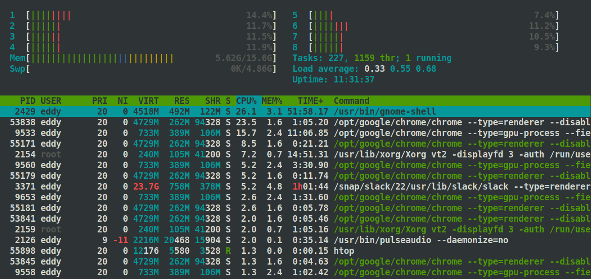

# DevOps Roadmap

Links to resources based on [this roadmap](https://roadmap.sh/devops)

A fair bit on content for this has been sourced from [system-design-primer](https://github.com/donnemartin/system-design-primer#nosql)

# Table of Contents

- [Learn a programming language](#learn-a-programming-language)
  * [Python](#python)
  * [Ruby](#ruby)
  * [Node.js](#nodejs)
  * [Go](#go)
  * [Rust](#rust)
- [Understand Different OS Concepts](#understand-different-os-concepts)
  * [Process Management](#process-management)
  * [Threads and Concurrenncy](#threads-and-concurrenncy)
  * [Sockets](#sockets)
  * [POSIX Basics](#posix-basics)
  * [Networking Concepts](#networking-concepts)
  * [Startup Management](#startup-management)
  * [Service Management](#service-management)
  * [I/O Management](#i-o-management)
  * [Process Management](#process-management-1)
  * [Memory and Storage](#memory-and-storage)
  * [File Systems](#file-systems)
- [Learn about Managing Servers](#learn-about-managing-servers)
  * [Operating System](#operating-system)
    + [Linux](#linux)
      - [SUSE Linux](#suse-linux)
      - [Debian](#debian)
      - [Fedora](#fedora)
      - [Ubuntu](#ubuntu)
      - [CentOS](#centos)
      - [RHEL](#rhel)
    + [Unix](#unix)
      - [FreeBSD](#freebsd)
      - [OpenBSD](#openbsd)
      - [NetBSD](#netbsd)
    + [Windows](#windows)
  * [Learn to live in Terminal](#learn-to-live-in-terminal)
    + [Terminal Multiplexers](#terminal-multiplexers)
      - [tmux](#tmux)
      - [screen](#screen)
    + [Learn Bash Scripting](#learn-bash-scripting)
    + [Vim/Nano/PowerShell/Emacs](#vim-nano-powershell-emacs)
    + [Compiling apps from source](#compiling-apps-from-source)
    + [System Performance](#system-performance)
    + [Text Manipulation Tools](#text-manipulation-tools)
    + [Process Monitoring](#process-monitoring)
    + [Network](#network)
    + [Others](#others)
- [Networking, Security and Protocols](#networking--security-and-protocols)
  * [Core Fundamentals](#core-fundamentals)
    + [Transmission Control Protocol (TCP)](#transmission-control-protocol--tcp-)
      - [3-way Handshake](#3-way-handshake)
    + [Transport Layer Security (TLS)](#transport-layer-security--tls-)
    + [Remote Procedure Call (RPC)](#remote-procedure-call--rpc-)
    + [Representational State Transfer (REST)](#representational-state-transfer--rest-)
  * [Emails](#emails)
    + [SMTP](#smtp)
    + [IMAPS](#imaps)
    + [POP3S](#pop3s)
    + [DMARC](#dmarc)
    + [SPF](#spf)
    + [Domain Keys](#domain-keys)
  * [HTTP](#http)
    + [Security](#security)
  * [HTTPS](#https)
  * [FTP](#ftp)
  * [SSL/TLS](#ssl-tls)
  * [SSH](#ssh)
  * [Port Forwarding](#port-forwarding)
- [What is and How to Setup a...](#what-is-and-how-to-setup-a)
  * [Reverse Proxy](#reverse-proxy)
    + [Concepts](#concepts)
    + [Nginx](#nginx)
    + [HAProxy](#haproxy)
  * [Caching Server](#caching-server)
    + [Overview](#overview)
    + [Redis](#redis)
    + [Varnish](#varnish)
    + [Memcached](#memcached)
    + [DAX (AWS DDB Cache)](#dax--aws-ddb-cache-)
  * [Forward Proxy](#forward-proxy)
  * [Load Balancer](#load-balancer)
    + [Concepts](#concepts-1)
    + [Nginx](#nginx-1)
    + [HAProxy](#haproxy-1)
  * [Firewall](#firewall)
  * [Queuing and Streaming Systems](#queuing-and-streaming-systems)
    + [Overview](#overview-1)
    + [Pub/Sub Model](#pub-sub-model)
    + [Producer/Consumer Model](#producer-consumer-model)
    + [Kafka](#kafka)
    + [Redis](#redis-1)
    + [RabbitMQ](#rabbitmq)
    + [ActiveMQ](#activemq)
    + [Kinesis (AWS)](#kinesis--aws-)
    + [SQS (AWS)](#sqs--aws-)
  * [Web Server](#web-server)
    + [IIS](#iis)
    + [Nginx](#nginx-2)
    + [Apache](#apache)
    + [Tomcat](#tomcat)
    + [Caddy](#caddy)
  * [Databases](#databases)
    + [Concepts](#concepts-2)
    + [SQL (Relational)](#sql--relational-)
      - [MSSQL](#mssql)
      - [MariaDB](#mariadb)
      - [PostgreSQL](#postgresql)
    + [NoSQL](#nosql)
      - [DynamoDB](#dynamodb)
      - [MongoDB](#mongodb)
      - [CouchDB](#couchdb)
      - [RocksDB](#rocksdb)
      - [HBase](#hbase)
      - [Cassandra](#cassandra)
    + [Key/Value](#key-value)
      - [Etcd](#etcd)
      - [Consul](#consul)
- [Learn Infrastructure as Code](#learn-infrastructure-as-code)
  * [Containers](#containers)
    + [Docker](#docker)
    + [LXC](#lxc)
    + [Packer (Image Building)](#packer--image-building-)
  * [Configuration Management](#configuration-management)
    + [Ansible](#ansible)
    + [Salt](#salt)
    + [Puppet](#puppet)
    + [Chef](#chef)
    + [PowerShell DSC](#powershell-dsc)
  * [Container Orchestration](#container-orchestration)
    + [Kubernetes](#kubernetes)
    + [Mesos](#mesos)
    + [Docker Swarm](#docker-swarm)
    + [Nomad](#nomad)
  * [Infrastructure Provisioning](#infrastructure-provisioning)
    + [Terraform](#terraform)
    + [CloudFormation](#cloudformation)
    + [Vagrant](#vagrant)
  * [Service Mesh](#service-mesh)
    + [Istio](#istio)
    + [Envoy](#envoy)
    + [Linkerd](#linkerd)
    + [Consul](#consul-1)
- [Learn some CI/CD tools](#learn-some-ci-cd-tools)
  * [Gitlab CI](#gitlab-ci)
  * [Github Actions](#github-actions)
  * [Bamboo](#bamboo)
  * [Azure DevOps](#azure-devops)
  * [Jenkins](#jenkins)
  * [Travis CI](#travis-ci)
  * [TeamCity](#teamcity)
  * [Circle CI](#circle-ci)
- [Learn How to Monitor Software and Infrastructure](#learn-how-to-monitor-software-and-infrastructure)
  * [Infrastructure Monitoring](#infrastructure-monitoring)
    + [Prometheus](#prometheus)
    + [Nagios](#nagios)
    + [Grafana](#grafana)
    + [Zabbix](#zabbix)
    + [Monit](#monit)
    + [Datadog](#datadog)
  * [Application Monitoring](#application-monitoring)
    + [Jaeger](#jaeger)
    + [New Relic](#new-relic)
    + [Instana](#instana)
    + [AppDynamics](#appdynamics)
    + [OpenTracing](#opentracing)
  * [Logs Management](#logs-management)
    + [Elastic Stack](#elastic-stack)
    + [Graylog](#graylog)
    + [Splunk](#splunk)
    + [Papertrail](#papertrail)
    + [Sysdig](#sysdig)
  * [Chaos Testing](#chaos-testing)
- [Cloud Providers](#cloud-providers)
  * [AWS](#aws)
  * [Google Cloud](#google-cloud)
  * [Azure](#azure)
  * [Heroku](#heroku)
  * [Digital Ocean](#digital-ocean)
  * [Linode](#linode)
  * [Vultr](#vultr)
- [Cloud Design Patterns](#cloud-design-patterns)
  * [Availability](#availability)
  * [Data Management](#data-management)
    + [CDNs](#cdns)
  * [Design and Implementation](#design-and-implementation)
  * [Management and Monitoring](#management-and-monitoring)

<small><i><a href='http://ecotrust-canada.github.io/markdown-toc/'>Table of contents generated with markdown-toc</a></i></small>

## Learn a programming language

### Python

### Ruby

### Node.js

### Go

### Rust

## Understand Different OS Concepts

### Process Management

### Threads and Concurrenncy

### Sockets

### POSIX Basics

### Networking Concepts

### Startup Management

- [Managing Linux Init/startup scripts](http://www.debianadmin.com/manage-linux-init-or-startup-scripts.html)

### Service Management

### I/O Management

### Process Management

### Memory and Storage

### File Systems

## Learn about Managing Servers

### Operating System

#### Linux

##### SUSE Linux

##### Debian

##### Fedora

##### Ubuntu

##### CentOS

##### RHEL

#### Unix

##### FreeBSD

##### OpenBSD

##### NetBSD

#### Windows

### Learn to live in Terminal

#### Terminal Multiplexers

##### tmux

##### screen

#### Learn Bash Scripting

#### Vim/Nano/PowerShell/Emacs

#### Compiling apps from source

gcc, make

#### System Performance

nmon, iostat, sar, vmstat

**Latency Comparison Numbers**

**Latency Comparison Visualisation**

#### Text Manipulation Tools

awk, sed, grep, sort, uniq, cat, cut, echo, fmt, tr, nl, egrep, fgrep, wc, jq

#### Process Monitoring

ps, top, htop, atop, lsof

- htop

Example: 

#### Network

nmap, tcpdump, ping, mtr, traceroute, dig, airmon, airodump, dig, iptables, netstat, netcat

#### Others

strace, dtrace, systemtap, uname, df, history

## Networking, Security and Protocols

### Core Fundamentals

#### Transmission Control Protocol (TCP)

Connection-oriented protocol over an IP network. Packets are guaranteed to reach the destination, in the original order using:

- Sequence numbers and checksum fields.
- Acknowledgement packets and automatic retransmission.

TCP also implements flow control and congestion control.

Web servers can achieve high throughput by keeping a large number of TCP connections open, at the cost of high memory usage. Connection pooling can help ease this, although this is out of scope for a section on TCP. Using UDP will also reduce the overhead that comes with TCP

##### 3-way Handshake

1. Client sends `SYN` to server
1. Server responds with `SYN-ACK`
1. Client responds with `ACK`

**Connection Established**

#### Transport Layer Security (TLS)

- [TLS Handshake](https://hpbn.co/transport-layer-security-tls/)

#### Remote Procedure Call (RPC)

- [Brief Overview](https://github.com/donnemartin/system-design-primer#remote-procedure-call-rpc)

Allows a client to remotely cause a procedure to execute on a different address space. The procedure is coded as if it were a local call, which abstracts the client/server communication details that are needed. 

Client program calls the client stub procedure.
Client stub procedure marshalls (packs) the procedure ID and argments into a request message and passes to Communication module
Communication module of client, sends to Communication module of the server
Server stub procedure unmarshalls the request
Server program executes procedure

Popular RPC frameworks include:

- [Protobuf](https://developers.google.com/protocol-buffers/)
- [Thrift](https://thrift.apache.org/)
- [Avro](https://avro.apache.org/docs/current/)

**Some advantages for using RPC:**

1. Size. Protocol buffers are compressed on the wire and they are a binary protocol, as opposed to REST which is usually a text protocol.
1. Enforcing typing. The client is able to validate that what it’s sending is reasonable, which saves time on the wire and makes code testable at compile time.
1. Standardization. Both server and client import the protobuf library/header/resource/package and the specific relevant definitions. So both sides are able to manipulate them directly as objects and barely need to do any parsing at all.
1. Definition is in code. Instead of a client and server just sort of randomly adding fields. You can’t do that in a protobuf because there’s a specification.
1. Backward compatibility. If you send a new field that an old library doesn’t know, it will just ignore it. (This is sort of like GraphQL)

#### Representational State Transfer (REST)

- [Brief Overview](https://github.com/donnemartin/system-design-primer#representational-state-transfer-rest)

REST is an architectural style, enforcing a client/server model. The client acts on a set of resources managed by the server. The server provides a representation of resources that can either manipulate or get a new representation of resources. All communications must be stateless and cacheable.

### Emails

#### SMTP

#### IMAPS

#### POP3S

#### DMARC

#### SPF

#### Domain Keys

### HTTP

- [Brief Overview](https://github.com/donnemartin/system-design-primer#hypertext-transfer-protocol-http)

HTTP is a protocol for transferring data from client to server (request/response). It operates on layer 7 of the OSI model. Typical HTTP verbs include:

||Verb||Description||Idempotent||Safe||Cacheable||
|---|---|---|---|---|
|GET|Read a resource|Yes|Yes|Yes|
|POST|Creates a resource or trigger a process that handles data|No|No|Yes if response contains freshness info|
|PUT|Creates or replaces a resource|Yes|No|No|
|PATCH|Partially updates a resource|No|No|Yes if response contains freshness info|
|DELETE|Deletes a resource|Yes|No|No|

[Source](https://github.com/donnemartin/system-design-primer#hypertext-transfer-protocol-http)

#### Security

- [Security Checklist](https://github.com/FallibleInc/security-guide-for-developers/blob/master/security-checklist.md)
- [What can go wrong](https://github.com/FallibleInc/security-guide-for-developers/blob/master/what-can-go-wrong.md)
- [OWASP Top 10](https://owasp.org/www-project-top-ten/)

### HTTPS

- [Detailed Overview](https://github.com/FallibleInc/security-guide-for-developers/blob/master/https.md)

### FTP

### SSL/TLS

### SSH

### Port Forwarding

## What is and How to Setup a...

- [Harvard lecture which serves as a good intro](https://www.youtube.com/watch?v=-W9F__D3oY4)

### Reverse Proxy

#### Concepts

Reverse proxies centralise internal services and provides public access to those services. The features are typically found on load balancers which makes the distinction a little blurry. 

- [Reverse Proxy vs Load Balancer](https://www.nginx.com/resources/glossary/reverse-proxy-vs-load-balancer/)

Benefits include:

- Increased security (allows keeping backends out of public facing subnets, abiliy to blacklist IPs)
- Increase scalability options
- SSL termination
- Compression
- Caching
- Static content serving (rather than retrieving from the backend server directly)

#### Nginx

#### HAProxy

### Caching Server

#### Overview

- [Brief Caching Intro](https://www.lecloud.net/post/9246290032/scalability-for-dummies-part-3-cache)
- [Overview of different types of caches](https://github.com/donnemartin/system-design-primer#cache)

**Cache-aside:** (also known as lazy loading) is when a cache is populated after a cache miss has occurred. 

**Eager loading:** is the opposite of lazy loading, where a process populates a cache proactively (eg when the content has been updated on the source server).

**Write-through:** is when the application uses the cache as the main data store. Data is read/written to the cache while the cache server is responsible for reading/writing to the backend database.

**Write-behind (write-back):** is similar to write-through except with an async process between the cache and database layers. The cache writes an event to a queue -> which is processed by an event processor -> which writes to a DB

**Refresh-ahead:** when the cache automatically refreshes content which is about to expire. Success depends on the accuracy of the prediction of items likely to be needed in the future.

#### Redis

- [Architecture Overview](http://qnimate.com/overview-of-redis-architecture/)

#### Varnish

#### Memcached

- [Architecture Overview](https://www.adayinthelifeof.nl/2011/02/06/memcache-internals/)

#### DAX (AWS DDB Cache)

### Forward Proxy

### Load Balancer

#### Concepts

- [Layer 4 LB])(https://www.nginx.com/resources/glossary/layer-4-load-balancing/):

  Checks the IP source/destination and port headers in the packet, performing NAT.

- [Layer 7 LB](https://www.nginx.com/resources/glossary/layer-7-load-balancing/):

  Looks at the application layer (such as contents of the header, message and cookies) to decide how to distribute requests. The LB will need to decrypt SSL/TLS traffic to inspect the contents.

Layer 4 LBs are more performant, at the cost of flexibility, compared with layer 7 LBs. This difference is usually negligable with modern hardware.

#### Nginx

- [Architecture Guide](https://www.nginx.com/blog/inside-nginx-how-we-designed-for-performance-scale/)

#### HAProxy

- [Architecture Guide](http://www.haproxy.org/download/1.2/doc/architecture.txt)

### Firewall

### Queuing and Streaming Systems

#### Overview

- [Asynchronism](https://www.lecloud.net/post/9699762917/scalability-for-dummies-part-4-asynchronism)
- [Brief Overview](https://github.com/donnemartin/system-design-primer#asynchronism)
- [Back Pressure](https://mechanical-sympathy.blogspot.com/2012/05/apply-back-pressure-when-overloaded.html)
- [Exponential Backoff](https://docs.aws.amazon.com/general/latest/gr/api-retries.html)

Back pressure is a way of managing queues and QoS for the end user. You can limit the queue size and respond to the request with a meaningful message, rather than exhausting resources for existing connections. Not doing this can create compounded problems such as an increase in cache misses (due to the processing server not being able to process the request). Typically, this is fed back to the user with a 503 (service unavailable) status code.

You can introduce a retry mechanism without causing more problems with exponetial backoff

#### Pub/Sub Model

#### Producer/Consumer Model

#### Kafka

#### Redis

Redis can be used as a simple message queue, as well has being a data store.

- [Pub/Sub Redis](https://redis.io/topics/pubsub)

#### RabbitMQ

- [Getting Starting Guides](https://www.rabbitmq.com/getstarted.html)

#### ActiveMQ

#### Kinesis (AWS)

#### SQS (AWS)

### Web Server

#### IIS

#### Nginx

#### Apache

#### Tomcat

#### Caddy

### Databases

#### Concepts

- [ACID](https://github.com/donnemartin/system-design-primer#relational-database-management-system-rdbms)
- [Federated (functional partitioning)](https://github.com/donnemartin/system-design-primer#federation)
- [Sharding](https://github.com/donnemartin/system-design-primer#sharding)
- [Denormalization](https://github.com/donnemartin/system-design-primer#denormalization)
- [SQL Tuning](https://github.com/donnemartin/system-design-primer#sql-tuning)

#### SQL (Relational)

##### MSSQL

##### MariaDB

##### PostgreSQL

#### NoSQL

- [Overview](https://github.com/donnemartin/system-design-primer#nosql)

##### DynamoDB

##### MongoDB

##### CouchDB

##### RocksDB

##### HBase

- [Architecture Overview](https://mapr.com/blog/in-depth-look-hbase-architecture/)

##### Cassandra

- [Architechure Overview](http://cassandra.apache.org/doc/latest/architecture/overview.html)

#### Key/Value

##### Etcd

##### Consul

## Learn Infrastructure as Code

### Containers

#### Docker

#### LXC

#### Packer (Image Building)

### Configuration Management

#### Ansible

#### Salt

#### Puppet

#### Chef

#### PowerShell DSC

### Container Orchestration

#### Kubernetes

#### Mesos

#### Docker Swarm

#### Nomad

### Infrastructure Provisioning

#### Terraform

#### CloudFormation

#### Vagrant

### Service Mesh

#### Istio

#### Envoy

#### Linkerd

#### Consul

## Learn some CI/CD tools

### Gitlab CI

### Github Actions

### Bamboo

### Azure DevOps

### Jenkins

### Travis CI

### TeamCity

### Circle CI

## Learn How to Monitor Software and Infrastructure

### Infrastructure Monitoring

#### Prometheus

#### Nagios

#### Grafana

#### Zabbix

#### Monit

#### Datadog

### Application Monitoring

#### Jaeger

#### New Relic

#### Instana

#### AppDynamics

#### OpenTracing

### Logs Management

#### Elastic Stack

#### Graylog

#### Splunk

#### Papertrail

#### Sysdig

### Chaos Testing

- [Principals of Chaos Engineering](http://principlesofchaos.org/?lang=ENcontent)

## Cloud Providers

### AWS

### Google Cloud

### Azure

### Heroku

### Digital Ocean

### Linode

### Vultr

## Cloud Design Patterns

### Availability

### Data Management

#### CDNs

- [Push CDNs](https://github.com/donnemartin/system-design-primer#push-cdns)
- [Pull CDNs](https://github.com/donnemartin/system-design-primer#pull-cdns)

### Design and Implementation

- [System Design Primer](https://github.com/donnemartin/system-design-primer)
- [Introduction to Zookeeper](https://www.slideshare.net/sauravhaloi/introduction-to-apache-zookeeper)
- [Building Microservices](https://cloudncode.blog/2016/07/22/msa-getting-started/)
- [re:Invent Scaling up to first 10 million users](https://www.youtube.com/watch?v=w95murBkYmU)

### Management and Monitoring
